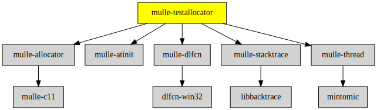

# mulle-testallocator

#### 🔄 C memory leak and double free checking

mulle-testallocator is a leak and double free checker for tests
(and at runtime). It builds upon [mulle-allocator](//github.com/mulle-c/mulle-allocator).


| Release Version                                       | Release Notes  | AI Documentation
|-------------------------------------------------------|----------------|---------------
|  [](//github.com/mulle-core/mulle-testallocator/actions) | [RELEASENOTES](RELEASENOTES.md) | [DeepWiki for mulle-testallocator](https://deepwiki.com/mulle-core/mulle-testallocator)


## Environment Variables

Debug support can be turned on and off with environment variables.

| Variable                         | Description
|--------------------------------- | ------------------------------------
| `MULLE_TESTALLOCATOR`            | Turn on automatic tracing during startup. (See below)
| `MULLE_TESTALLOCATOR_TRACE`      | Trace setup, allocations and deallocations. <UL> <LI>1: trace setup and exit.</LI><LI>2: additionally traces allocations.</LI><LI>3: adds a stacktrace to the output (on participating platforms).</LI></UL> A value larger than 3 increases the verbosity of the stacktrace. This implicitly also enables MULLE_TESTALLOCATOR if set to non-zero
| `MULLE_TESTALLOCATOR_DONT_FREE`  | Memory is not actually freed, this can be useful, when reuse of memory makes the trace too confusing. Obviously this can burn memory away quickly.
| `MULLE_TESTALLOCATOR_FIRST_LEAK` | Only report the first leak if set to 1 or YES.
| `MULLE_TESTALLOCATOR_MAX_SIZE`   | Creates an out of memory condition if more than max size is allocated (in one call)

## Usage

###  Use `mulle_testallocator` for leak detection

Use `mulle_malloc` and friends instead of `malloc` in your code.

So instead of:

``` c
   malloc( 1848);
   calloc( 18, 48);
   s = strdup( "VfL Bochum 1848");
   realloc( s, 18);
   free( s);
```

write

``` c
   mulle_malloc( 1848);
   mulle_calloc( 18, 48);
   s = mulle_strdup( "VfL Bochum 1848");
   mulle_realloc( s, 18);
   mulle_free( s);
```

Now you can easily check for leaks using this `mulle_testallocator` library.
Just run your code with the environment variable MULLE_TESTALLOCATOR
set to YES.
mulle-testallocator will tell you your leaks when the executable exits.

> #### Note
>
> This feature needs a C-compiler that handles `__attribute__(((constructor))`.
>
> The order of constructor and atexit calls is dependent on the link order.
> To catch all leaks, it is advantageous to link mulle-testallocator ahead of
> all other code. 


#### Manual method

Or you can wrap your code inside the following piece of code:

``` c
mulle_testallocator_initialize();
mulle_default_allocator = mulle_testallocator;
{
   mulle_malloc( 1848);
   mulle_calloc( 18, 48);
   s = mulle_strdup( "VfL Bochum 1848");
   mulle_realloc( s, 18);
   mulle_free( s);
}
mulle_testallocator_reset();
```

and `mulle_testallocator_reset` will tell you about your leaks. You
don't need the 'constructor' support then.

All `mulle_testallocator` routines will check for erroneous frees and
wrong pointers.

> #### Tip
>
> Locate Objective-C leaks easily with
>
> ``` sh
> MULLE_TESTALLOCATOR_TRACE=2 \
> MULLE_OBJC_PEDANTIC_EXIT=YES  \
> MULLE_OBJC_EPHEMERAL_SINGLETON=YES \
> MULLE_OBJC_TRACE_INSTANCE=YES \
> MULLE_OBJC_TRACE_METHOD_CALL=YES \
>    ./kitchen/Debug/myexe
> ```
>
> Then search for the leak address and you will see the method that
> allocated the leak.
>


### You are here




## Add

You should use [whole archive linking](//stackoverflow.com/questions/25038974/force-load-linker-flag-for-other-platforms) as otherwise the library may just 
be omitted from the link. (The mulle-sde mark `all-load` will do this for you).


### Add as an individual component

Use [mulle-sde](//github.com/mulle-sde) to add mulle-testallocator to your project:


``` sh
mulle-sde dependency add --marks all-load,no-singlephase \
                         --github mulle-core \
                         mulle-testallocator
```

To only add the sources of mulle-testallocator with dependency
sources use [clib](https://github.com/clibs/clib):


``` sh
clib install --out src/mulle-core mulle-core/mulle-testallocator
```

Add `-isystem src/mulle-core` to your `CFLAGS` and compile all the sources that were downloaded with your project.


## Install

Use [mulle-sde](//github.com/mulle-sde) to build and install mulle-testallocator and all dependencies:

``` sh
mulle-sde install --prefix /usr/local \
   https://github.com/mulle-core/mulle-testallocator/archive/latest.tar.gz
```

### Legacy Installation

#### Requirements

Preferably install mulle-core and be done with it:

| Requirements                                     | Description
|--------------------------------------------------|-----------------------
| [mulle-core](//github.com/mulle-core/mulle-core) |🌋 Almagamated library of mulle-core + mulle-concurrent + mulle-c


Or if you really want to do it exhaustively:

| Requirements                                 | Description
|----------------------------------------------|-----------------------
| [mulle-allocator](https://github.com/mulle-c/mulle-allocator)             | 🔄 Flexible C memory allocation scheme
| [mulle-atinit](https://github.com/mulle-core/mulle-atinit)             | 🤱🏼 Compatibility library for deterministic initializers
| [mulle-dlfcn](https://github.com/mulle-core/mulle-dlfcn)             | ♿️ Shared library helper
| [mulle-stacktrace](https://github.com/mulle-core/mulle-stacktrace)             | 👣 Stracktrace support for various OS
| [mulle-thread](https://github.com/mulle-concurrent/mulle-thread)             | 🔠 Cross-platform thread/mutex/tss/atomic operations in C

#### Download & Install

Download the latest [tar](https://github.com/mulle-core/mulle-testallocator/archive/refs/tags/latest.tar.gz) or [zip](https://github.com/mulle-core/mulle-testallocator/archive/refs/tags/latest.zip) archive and unpack it.

Install **mulle-testallocator** into `/usr/local` with [cmake](https://cmake.org):

``` sh
PREFIX_DIR="/usr/local"
cmake -B build                               \
      -DMULLE_SDK_PATH="${PREFIX_DIR}"       \
      -DCMAKE_INSTALL_PREFIX="${PREFIX_DIR}" \
      -DCMAKE_PREFIX_PATH="${PREFIX_DIR}"    \
      -DCMAKE_BUILD_TYPE=Release &&
cmake --build build --config Release &&
cmake --install build --config Release
```


## Author

[Nat!](https://mulle-kybernetik.com/weblog) for Mulle kybernetiK  


